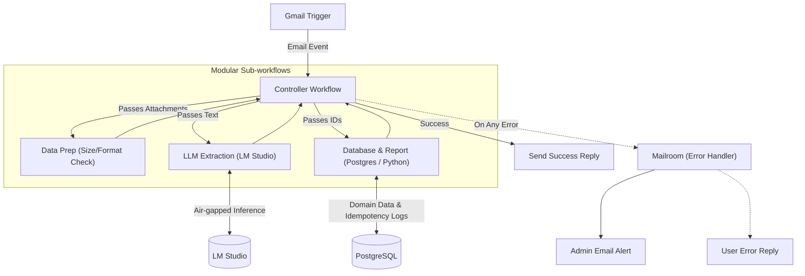

# Architecture Diagrams

## Structural Seed

```mermaid
flowchart TD
    Gmail["Gmail Trigger"] -->|Email Event| Controller["Controller Workflow"]
  
    subgraph Modular Sub-workflows
        Controller -->|Passes Attachments| DataPrep["Data Prep (Size/Format Check)"]
        DataPrep --> Controller
        Controller -->|Passes Text| LLM["LLM Extraction (LM Studio)"]
        LLM --> Controller
        Controller -->|Passes IDs| DB["Database & Report (Postgres / Python)"]
        DB --> Controller
    end
  
    Controller -.->|On Any Error| Mailroom["Mailroom (Error Handler)"]
    Mailroom --> AdminAlert["Admin Email Alert"]
    Mailroom -.-> UserError["User Error Reply"]
  
    Controller -->|Success| UserReply["Send Success Reply"]
  
    DB <-->|Domain Data & Idempotency Logs| Postgres[("PostgreSQL")]
    LLM <-->|Air-gapped Inference| LMStudio[("LM Studio")]
```
